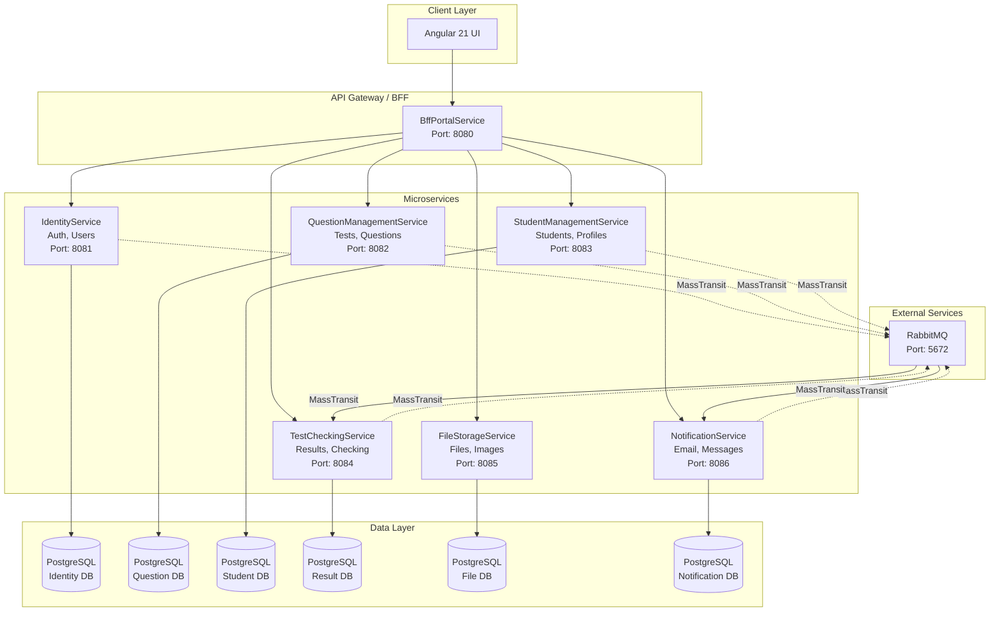

# TestsDelivery Microservices Architecture Diagram

## Архитектурная диаграмма



## Компоненты сервисов

Каждый микросервис следует слоистой архитектуре:

```
ServiceName/
├── ServiceName.Domain/              # Слой предметной области
│   └── Entities/                    # Сущности (Aggregates)
│   └── ValueObjects/                # Объекты значений
│   └── Exceptions/                  # Пользовательские исключения
│
├── ServiceName.Application/         # Слой приложения (бизнес-логика)
│   ├── Services/                    # Сервисы приложения
│   ├── DTOs/                        # Передача данных
│   ├── Specifications/              # Спецификации (паттерн)
│   ├── Contracts/                   # Контракты (интерфейсы)
│   ├── Exceptions/                  # Исключения приложения
│   └── Infrastructure/              # Инфраструктура приложения
│
├── ServiceName.Infrastructure/      # Слой инфраструктуры
│   ├── Database/                    # EF Core, миграции
│   ├── Repositories/                # Репозитории (Generic + Specific)
│   ├── MassTransit/                 # RabbitMQ конфигурация
│   └── External/                    # HTTP clients (Refit)
│
└── ServiceName.WebApi/              # Слой веб-API
    ├── Controllers/                 # API endpoints
    ├── Settings/                    # Настройки (AppSettings)
    ├── Shared/                      # Общие компоненты
    │   └── ResponseResultModel.cs   # Шаблон ответов API
    ├── HealthChecks/                # Health checks
    ├── Handler/                     # Exception handlers
    ├── Factories/                   # Factories (ProblemDetails)
    └── DependencyInjection.cs       # Регистрация зависимостей
```

## Паттерны проектирования

| Паттерн | Применение |
|---------|-----------|
| **Generic Repository** | Единый интерфейс для CRUD операций |
| **Unit of Work** | Транзакционное управление репозиториями |
| **Specifications** | Фильтрация и бизнес-правила |
| **CQRS** | Разделение команд и запросов |
| **Unit of Work** | Компиляция репозиториев в единую транзакцию |
| **Factory** | Создание объектов с логикой (ProblemDetails) |
| **Strategy** | Разные стратегии проверки тестов |

## Протоколы связи

### Synchronous (REST API)
- **QuestionManagementService** ↔ **BffPortalService**
- **StudentManagementService** ↔ **BffPortalService**
- **IdentityService** ↔ **BffPortalService** ( и其它 сервисы)

### Asynchronous (RabbitMQ + MassTransit)
- **IdentityService** → **NotificationService** (user created)
- **TestCheckingService** → **NotificationService** (test result ready)
- **StudentManagementService** → **TestCheckingService** (new student registration)

## Docker Compose Network

```yaml
networks:
  testsdelivery-network:
    driver: bridge

services:
  rabbitmq:
    networks: [testsdelivery-network]
  
  identity-service:
    networks: [testsdelivery-network]
  
  question-service:
    networks: [testsdelivery-network]
  
  # ... остальные сервисы
```

## Health Check Endpoints

Каждый сервис предоставляет:
- `/health` - Полная проверка состояния (DB, RabbitMQ)
- `/quickhealth` - Быстрая проверка (только статус)

Example: `http://localhost:8082/health`
